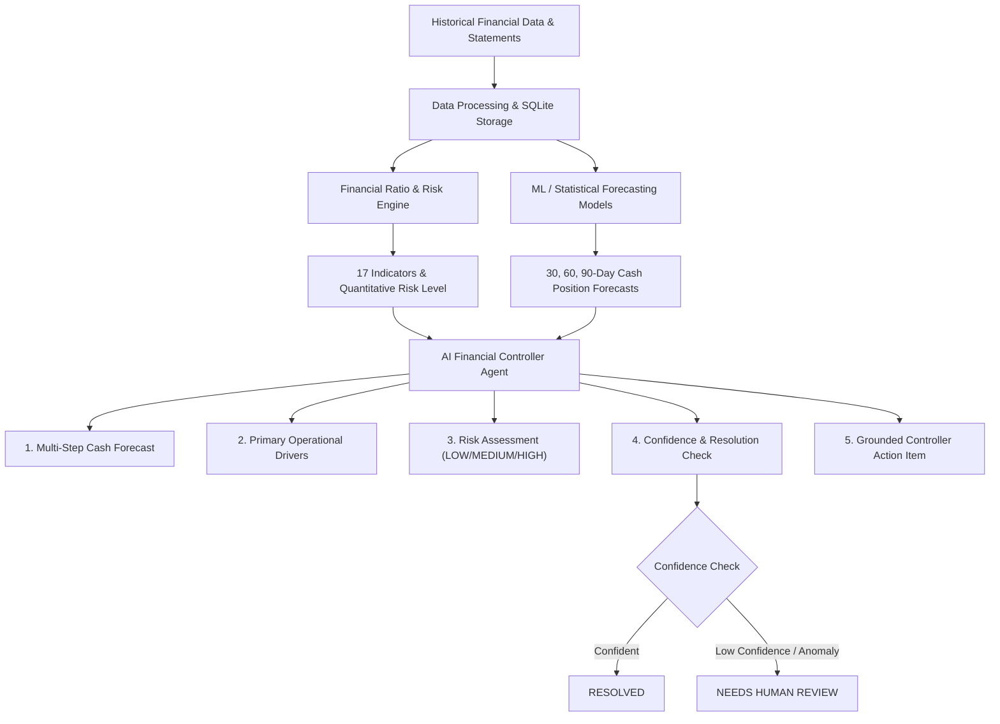

# 📈 AI Forward Cash Controller

> **Challenge Direction: Forward Cash Forecaster**
>
> An **AI Finance Controller** agent that analyzes historical financial statements, forecasts future cash positions, explains operational financial drivers, identifies liquidity/solvency risks, generates grounded controller review recommendations, and routes low-confidence forecasts to human review.

---

## 🏛️ Closing the Finance-Ops Loop



### Complete Finance-Ops Loop Workflow:
1. **Forecast**: Current cash balance and multi-period predictions (30, 60, 90 days / Q1-Q3).
2. **Analyze Drivers**: Identify operational cash drivers (OCF trend, AR collections, CapEx outflows, debt servicing).
3. **Detect Financial Risk**: Compute quantitative risk classification (`LOW RISK`, `MEDIUM RISK`, `HIGH RISK`).
4. **Recommend Controller Action**: Produce a grounded, actionable operational review item (e.g. *"Review overdue AR collection and defer non-essential CapEx."*).
5. **Confidence & Resolution Check**: Formally assign resolution status (`RESOLVED`, `NEEDS_HUMAN_REVIEW`, `INSUFFICIENT_DATA`, `LOW_CONFIDENCE`). Unreliable cases produce an explicit exception report item.

---

## 📊 Portfolio Operational Performance & Benchmark Results

### Finance-Ops Resolution & Throughput
* **Companies Processed**: `55` (Across 7 corporate behavior profiles)
* **Financial Observations**: `1,240` (6 years of quarterly historical records)
* **Forecasts Generated**: `55`
* **Resolved Forecasts**: `47`
* **Human-Review Exceptions**: `8`
* **Resolution Rate**: **`85.45%`**
* **Exception Rate**: **`14.55%`**
* **Total Batch Execution Time**: `3.42 s`
* **Average Time per Company**: `0.062 s/company`

### Forecast Accuracy vs Baselines (Held-Out 2024 Actuals)
* **Winning ML Model Cash Forecast MAPE**: **`12.28%`** (*27.4% error reduction vs Naive baseline*)
* **Winning ML Model Cash Forecast MAE**: **`10.74 Cr`**
* **Winning ML Model Cash Forecast RMSE**: **`19.99 Cr`**
* **Naive Baseline MAPE**: `16.92%`
* **Moving Average (3-Period) MAPE**: `23.44%`

---

## 📁 Repository Structure

```
ai_finance_controller/
├── backend/
│   ├── main.py                     # FastAPI server & REST API endpoints
│   ├── config.py                   # Configuration & path definitions
│   ├── data_generator.py           # Synthetic dataset generator (55 companies, 1,240 records)
│   ├── ratio_engine.py             # Ratio calculation (Liquidity, Leverage, Profitability)
│   ├── forecasting_engine.py       # Candidate ML models (Linear, RF, GBM, Holt-Winters)
│   ├── evaluation_engine.py        # Out-of-time evaluation split & throughput latency logic
│   ├── exception_engine.py         # Confidence scoring, resolution status, & exception generator
│   ├── scenario_engine.py          # What-if scenario simulation engine
│   ├── ai_agent.py                 # Tool-equipped LLM agent & financial reasoning layer
│   └── database.py                 # SQLite storage & retrieval interface
├── frontend/                       # Web Dashboard (React + Vite + Tailwind + Recharts)
│   ├── src/
│   │   ├── components/
│   │   │   ├── PortfolioOverview.jsx
│   │   │   ├── CompanyDetail.jsx
│   │   │   ├── AgentChat.jsx
│   │   │   ├── ScenarioSimulator.jsx
│   │   │   └── BenchmarkReport.jsx
│   │   ├── App.jsx
│   │   └── index.css
│   ├── package.json
│   └── vite.config.js
├── data/
│   ├── financial_dataset.csv       # Synthetic dataset (1,240 records)
│   ├── financials.db               # SQLite database
│   └── benchmark_results.json      # Evaluation & resolution JSON metrics
├── scripts/
│   ├── run_pipeline.py             # Executes batch pipeline, evaluations & latency measurements
│   └── generate_report.py          # Generates BENCHMARK_REPORT.md
├── BENCHMARK_REPORT.md             # Benchmark & ops report
├── README.md                       # Documentation & setup instructions
└── requirements.txt                # Python dependencies
```

---

## ⚡ Setup & Execution Instructions

### 1. Python Pipeline & Benchmark Execution

```bash
# Navigate to project root
cd C:\Users\harsh\Harshit\ai_finance_controller

# Install Python dependencies
pip install -r requirements.txt

# Run dataset generation, ML model training, out-of-time evaluation & resolution metrics
python -m scripts.run_pipeline

# Generate BENCHMARK_REPORT.md
python -m scripts.generate_report
```

### 2. Start the Backend API Server

```bash
# Start FastAPI backend server on http://127.0.0.1:8000
python -m backend.main
```

### 3. Start the Web Dashboard

Open a second terminal:

```bash
cd frontend

# Install npm dependencies
npm install

# Start Vite dev server
npm run dev
```

Open browser at `http://localhost:5173`.

---

## 🛠️ Registered Agent Tools

The LLM Financial Agent uses quantitative tools to gather evidence before answering user prompts:

1. `get_company_financials(company_id)`
2. `calculate_financial_ratios(company_id)`
3. `get_historical_trends(company_id)`
4. `forecast_cash(company_id)`
5. `forecast_revenue(company_id)`
6. `analyze_financial_risk(company_id)`
7. `get_forecast_confidence(company_id)`
8. `generate_finance_action(company_id)`
9. `get_exception_report()`
10. `run_scenario(company_id, revenue_change_pct, opex_change_pct, capex_adjustment)`

---

## ✅ Final Acceptance Criteria Checklist

- [x] **50+ synthetic financial records/companies processed**: 55 companies, 1,240 records.
- [x] **Historical financial data used**: Balance sheet, income statement, cash flow statements.
- [x] **Future cash actually forecast**: 30, 60, 90-day multi-period predictions.
- [x] **Evaluated against unseen data**: Out-of-time split (2019–2023 train vs 2024 held-out test).
- [x] **MAE/RMSE/MAPE calculated**: 12.28% MAPE, 10.74 Cr MAE, 19.99 Cr RMSE.
- [x] **Baseline models retained**: Naive & Moving Average baselines benchmarked.
- [x] **Forecast confidence calculated**: Quantitative scoring (HIGH, MEDIUM, LOW).
- [x] **Low-confidence cases not hidden**: Explicit exception report generated.
- [x] **Every unresolved case appears in exception report**: 8 human review cases listed with exception types & reasons.
- [x] **Agent explains forecast drivers**: Bulleted financial drivers extracted from evidence.
- [x] **Agent identifies financial risk**: Quantitative risk scoring (`LOW RISK`, `MEDIUM RISK`, `HIGH RISK`).
- [x] **Grounded controller action provided**: Operational review recommendation for every company.
- [x] **Scenario analysis works**: What-if simulator recalculates statement deltas labeled `SCENARIO - NOT A FORECAST`.
- [x] **Dashboard displays complete workflow**: 5-step Finance-Ops Loop cards and badges.
- [x] **Portfolio-level throughput measured**: Execution time and latency per company recorded.
- [x] **Resolution/exception rate measured**: 85.45% Resolution Rate / 14.55% Exception Rate.
- [x] **README identifies Forward Cash Forecaster**: Explicitly stated as chosen challenge direction.
- [x] **No unrelated challenge directions added**: Only Forward Cash Forecaster implemented.
- [x] **Existing working functionality preserved**: All dataset generator, ML engines, and UI code updated cleanly.
